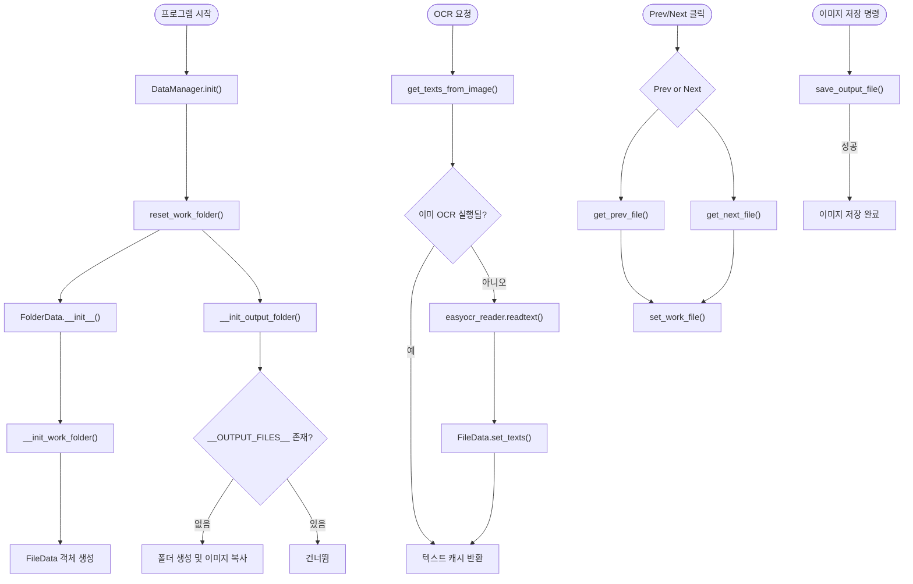

### 함수 호출 흐름 개요

* **DataManager.init()**
  초기화 진입점. 이미지 폴더 스캔·출력폴더 준비·EasyOCR 모델 로드까지 한 번에 실행.
* **DataManager.reset\_work\_folder() → FolderData → FileData**
  이미지 목록을 읽어 `FileData` 객체들을 만들고, 첫 번째 이미지를 현재 작업 파일(work file)로 등록.
* **DataManager.\_\_init\_output\_folder()**
  `__OUTPUT_FILES__` 폴더를 생성하고 원본 이미지를 복사해 저장 위치를 확보.
* **DataManager.get\_texts\_from\_image()**
  ‑ 캐시된 OCR 결과가 있으면 즉시 반환.
  ‑ 없으면 `easyocr_reader.readtext()` 호출 → `FileData.set_texts()`로 결과 저장 → `TextData` 객체 리스트 생성 후 반환.
  실패 시 `tkinter.messagebox`로 경고.
* **DataManager.get\_prev\_file() / get\_next\_file()**
  현재 작업 파일 인덱스를 기준으로 앞·뒤 이미지를 가져오고 `FolderData.set_work_file()`로 교체.
* **DataManager.save\_output\_file()**
  변환된 `PIL.Image`를 출력 폴더로 저장. PNG 외 확장자는 RGB 변환 후 저장.

---

---

#### 핵심 포인트

1. **Single‑entry 초기화**: `DataManager.init()` 한 번이면 이미지 스캔·OCR 모델 로드까지 끝남. 별도 재호출 불필요.
2. **OCR 중복 방지**: `FileData.is_ocr_executed` 플래그로 동일 이미지 재인식 차단. 성능·비용 절감.
3. **출력 폴더 자동 관리**: 원본과 결과물을 물리적으로 분리해 원본 보호 및 버전 관리 용이.
4. **파일 네비게이션 독립**: Prev/Next 로직이 `FolderData` 목록만 사용하므로 UI 레이어 변경 시에도 재사용 가능.
5. **의존성 단순화**: OCR 외부 라이브러리는 EasyOCR 하나. 얼굴 검출은 `set_faces()`에 좌표만 주입하면 되므로 모듈 교체 부담이 없음.
